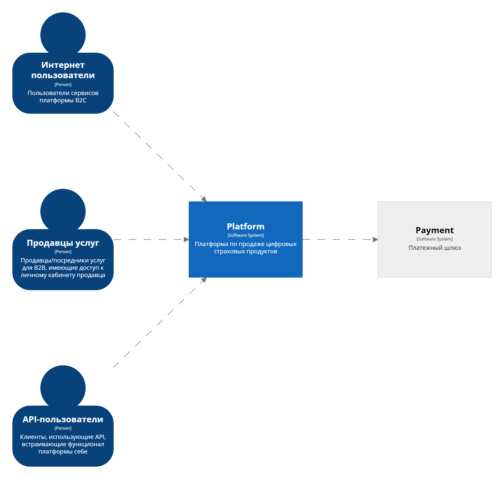
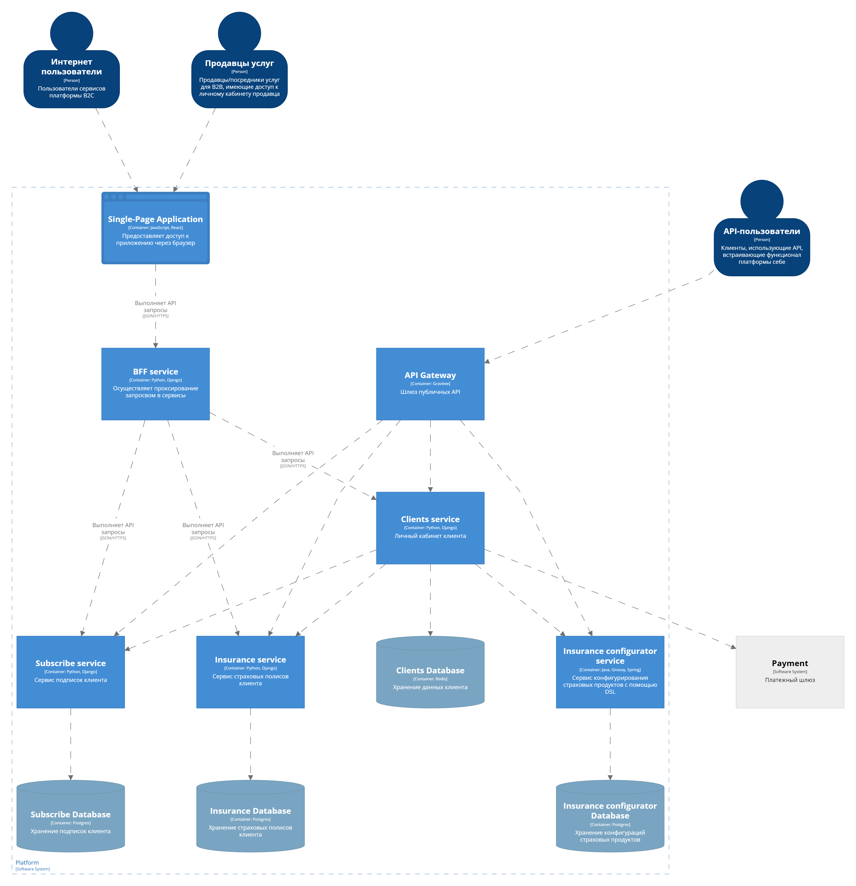
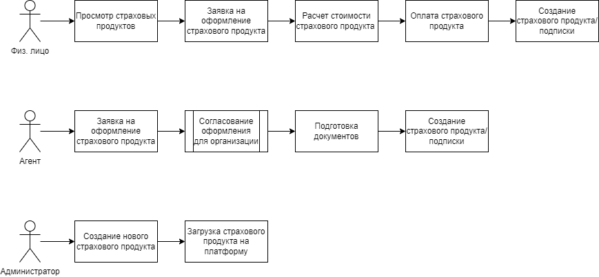

# Тестовое задание на позицию Solution Архитектор для BestDoctor

## Задание
InsureTech платформа позволяет продавать и обслуживать несколько типов
продуктов:
- сертификат на обслуживание - при продаже оформляется обезличенный
сертификат, который можно активировать позже, результатом активации
является полис или договор на обслуживание конкретного лица;
- страховой полис - всегда оформляется на конкретное лицо или группу лиц,
имеет конечный период действия;
- подписка - действует на оплаченный период, может быть продлена при
оплате следущего периода;

Есть несколько каналов продаж - прямое заключение B2B договоров, B2C
продажи через мобильное приложение, B2C продажи через партнеров.
Основной запрос бизнеса - гибко конфигурировать и продавать продукты.

Предложите арихитектурное решение в рамках InsureTech платформы
относительно продажи продуктов, не углубляясь в обслуживание, учет и
управление убытками

**Доп информация:**
Сейчас мы одни из первых в России планируем запускать Embedded insurance (Встроенное страхование) - новая и незанятая ниша на рынке страхования с большим потенциалом, доступная только технологичным и быстрым страховым компаниям.

Мы создадим продукт, который позволит бесшовно встроить страховой продукт прямо в цифровой пользовательский путь любого партнёра, предложить клиенту покупку недорогого и гибкого продукта в несколько кликов в момент, когда это нужно.

Для этого нам необходимо запустить технологичную платформу, которая поможет быстро (за 1 неделю) создавать и запускать новые страховые продукты в количестве нескольких сотен или даже тысяч штук. Процесс запуска и обслуживания новых продуктов должен быть доведен до идеально быстрого: от конфигурации продукта с набором включенных рисков и сумм по ним, ценообразования и встраивания в клиентские пути партнера, до фиксации убытков и обслуживания по этим продуктам.

Все это - важные составляющие конвейера, который должен позволить нам безболезненно создавать новые продукты с лучшим time-to-market на рынке.

В платформе есть все, что вам потребуется (захочется) для решения задачи. Мы ждём описания взаимодействия сущностей под гибкую продажу любых продуктов.

# Решение

Допущение: поскольку нет связи с заказчик для уточнения требований, используем гипотетические ответы

## Требования
### Бизнес-цели
- Продажа цифровых страховых продуктов
- Быстрый способ создания и конфигурирования новых страховых продуктов

### Функциональные требования
- Покупка цифрового страхового продукта
- Активация цифрового страхового продукта
- Возможность продления подписки на страховой продукт
- Предоставление доступа партнерам к функционалу оформления страховых продуктов   
- Гибкая настройка страхового продукта

### Нефункциональные требования
- Отказоустойчивость (Число пользователей в единицу времени, число запросов в единицу времени)
- Доступность (Значение % при котором пользователь имеет доступ к ресурсу)
- Безопасность (Обеспечение Защиты перс. данных, использование защищенных каналов для взаимодействия между сервисами, MTLS)
- Требования к удобству использования (Число переходов между страницами для совершения заказа)
- Внешние интерфейсы (Интеграция с платежными сервисами, доступность внешних систем для оплаты заказа)

### Cтейкхолдеры и их интересы
Клиенты - физические лица:
- Просмотр приобретенных страховых продуктов
- Возможность покупки страхового продукта

Агенты:
- Возможность просмотра актуальных страховых продутов и программ
- Возможность оформления страхового продукта для организации и сотрудников

Пользователи API:
- Использование API для получения информации о страховых продуктах
- Использование API для оформления заявки на покупки страхового продукта

### Сценарии критических бизнес-процессов
- Покупка клиентом страхового продукта.
Клиент выбирает страховой продукт, переходит на страницу оплаты. После оплаты необходимо получить актуальный статус оплаты и активировать страховой продукт клиента.
- Просмотр текущих страховых продуктов и информация по конкретному страховому продукту.
Клиент аутентифицируется на платформе и видит все свои актуальные страховые продукты. При выборе одного из них клиенту показывается номер страхового продукта и дополнительная информация.
- Оформление агентом страхового продукта.
Агент загружает информацию об организации и сотрудниках. Данные сохраняются в системе.

## Ограничения

Технологические ограничения:
- Ограничения web-сайта (скорость доступа, функциональность, UI/UX)
- Ограничения безопасности при доступе к личному кабинету и оплате заказа
- Ограничения доступности сайта и связанных с ним подсистем
- Ограничения web-сервера и сопровождение

Бизнес-органичения:
- Ограничения по хранению персональных данных
- Недостаток финансирования для разработки и поддержания инфраструктуры

## Контекстная диаграмма C4
- [Исходник диаграммы для Structurizr](./workspace.dsl)
- [Интерпретатор DSL - Structurizr](https://structurizr.com/dsl)

## Контейнерная диаграмма C4

## План поэтапной разработки и расширения системы
1. Разработка функционала страховых продуктов для физ. лиц
   1. Просмотр
   2. Приобретение
2. Разработка функционала страховых продуктов для агентов
   1. Оформление для организаций
   2. Документальное сопровождение сделки
3. Конструктор страховых продуктов. Использование DSL для создания сценариев и расчета страховых премий

## Атрибуты качества
- Наблюдаемость (Мониторинг сервисов и инфраструктуры)
- Информационная безопасность (Обеспечение хранения персональных данных)
- Производительность (Обеспечение требуемого отклика сервисов)
- Масштабируемость (Возможность обеспечивать работоспособность сервиса с учетом нагрузки)

## Анализ и описание архитектурных опций и обоснование выбора
С учетом требований, для большинства функций необходимо самостоятельное решение (разработка с учетом специфики).
В качестве смежных сервисов необходимо использовать инструменты обеспечивающие:
- Аутентификацию и хранение аутентификационных данных пользователей (SSO: Keycloak и др.)
- Оплату услуг (Провайдеры и платежные шлюзы)
- Электронный документоборот для сопровождения сделки B2B (ЭДО: готовые решения или Camunda, Activity и др.)

## Список ADR
- Языки программирования разработки
- Архитектурный стиль приложения. Выделение сервисов
- Форматы и протоколы обмена сообщениями между частями системы
- Архитектура сервиса "Личный кабинет клиента"
- Архитектура сервиса "Страховые полисы клиента"
- Архитектура сервиса "Подписки клиента"
- Архитектура сервиса "Конфигурирования страховых продуктов"
- Безопасность хранения персональных данных в БД
- Выделение публичных API на шлюз API
- Использование внешнего платежного шлюза

## Сценарии использования приложения
Предпосылки: пользователь аутентифицирован и авторизован.

Клиент Физ.лицо (B2C клиент):
- Открывает личный кабинет
- Выбирает цифровой страховой продукт
- Заполняет форму
- Происходит расчет стоимости страховки
- Оплачивает страховку
- Получает страховой полис (подписку)

Агент (B2B, B2C):
- Создаёт/загружает договор в систему
- Происходит согласование со всеми заинтересованными лицами
- Подготавливаются необходимые документы для сделки
- Происходит оплата (или загрузка информации об оплате)
- Оформляется пакет документов для организации/сотрудников

## Основные представления

Функциональное представление (functional viewpoint)

Информационное представление (informational viewpoint)

## Анализ рисков созданной архитектуры, компромиссов
1. Риск хранения персональных данных
2. Обеспечение надежности системы (доступности системы)
3. Риски проведения оплаты (использование платежных шлюзов)
4. Риски масштабирования системы с учетом роста числа пользователей

## Стоимость владения системой
По данным https://bestdoctor.ru/tariff-dms в системе присутсвует более 100 тысяч клиентов из 140 российских и международных компаний.

По данным https://tass.ru/ekonomika/16370665 в системе более 280 тыс. человек.

Примем за рост числа пользователей 20% в год, т.е. до 30 новых клиентов в год.

Для предложенной архитектуры не требуется больших вычислительных ресурсов.
Однако для хранения событий действий пользователей необходимо учесть хранение всех событий (оформление страховых случаев, хранение документов, поддержка системы моделирования бизнес процессов BPM).

**Оценка стоимости**
- Client service - 1Ghz 2CPU, 4Gb RAM, 10Gb HDD
- Insurance service - 1Ghz 2CPU, 4Gb RAM, 10Gb HDD
- Subscribe service - 1Ghz 2CPU, 4Gb RAM, 10Gb HDD
- Insurance configurator service - 1Ghz 2CPU, 4Gb RAM, 10Gb HDD
- Database X4 (для каждого сервиса) - 1Ghz 2CPU, 2Gb RAM, 100Gb HDD
- API Gateway - 1Ghz 2CPU, 4Gb RAM, 10Gb HDD
- BFF - 1Ghz 2CPU, 4Gb RAM, 10Gb HDD
- Nginx - 3Ghz 1CPU, 2Gb RAM, 20Gb HDD

Следует также учесть затраты:
- на инфраструктуру: виртуализацию (Docker) и оркестрацию (k8s)
- на мониторинг (ELK, Grafana)

В решении (за отсутствием данных) не учтены:
- механизмы асинхронного взаимодействия
- подсистемы хранения файлов (договоров, сканов/копий документов)
- механизмы репликации и кластеризации данных БД